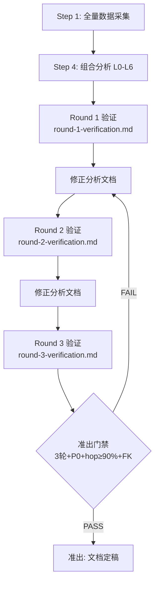

# arch-analyzer

项目架构分析插件，提供七层递进分析框架 + 双文档交替驱动验证闭环（3轮强制 + FK-first SQL + 准出门禁），确保分析结论有逐跳数据证据支撑。

## 功能特性

### 七层分析框架
- **L0 服务全景**：扫描服务入口、下游依赖、流量统计
- **L1 项目概览**：系统定位、业务价值、核心能力
- **L2 业务全景**：业务场景分类、触发来源
- **L3 核心链路**：核心业务识别、链路深度分析（支持交互确认）
- **L4 技术流程**：时序图、状态机
- **L5 数据模型**：全量 ER 图、表结构详情
- **L6 配置扩展**：配置项、策略规则

### 双文档交替驱动验证（v4.0）
- **双文档模型**: 分析文档（可修正）+ 验证文档（不可变），交替驱动迭代
- **3 轮强制验证**: Round 1 初始验证 → Round 2 修正验证 → Round 3 全量回归
- **FK-first SQL**: 每跳使用外键关联（列FK > JSON FK > 跨模块FK，禁止泛化主键）
- **准出门禁**: 4 条件（3轮 + P0 全PASS + hop≥90% + FK合规）
- **逐跳证据链**: 每一跳有完整 SQL + 验证结果 + FK 类型标注

## 使用方法

### 启动分析（数据驱动模式，默认）

```bash
# 标准分析 — 自动启动完整数据驱动验证闭环
/arch-analyze

# 快速分析（L0-L1）
/arch-analyze depth=quick

# 深度分析（L0-L6，含全量 ER 图 + 完整验证）
/arch-analyze depth=deep

# 指定输出路径
/arch-analyze output=docs/my-analysis.md
```

### 双文档验证

```bash
# 执行验证轮次
/arch-verify round 1
/arch-verify round next

# 查看 3 轮进度
/arch-verify status

# 准出门禁检查
/arch-verify gate
```

### 持续改进

```bash
# 自动识别改进方向
/arch-loop auto

# 指定改进方向
/arch-loop depth      # 增加分析深度
/arch-loop coverage   # 扩展覆盖范围
/arch-loop accuracy   # 提升准确性
```

### 获取模板

```bash
# 获取完整模板
/arch-template

# 获取特定层级模板
/arch-template type=layer3

# 获取 Mermaid 图表模板
/arch-template type=mermaid
```

## 分析深度说明

| 深度 | 覆盖层级 | 适用场景 |
|------|---------|---------|
| `quick` | L0-L1 | 快速了解项目（5-10分钟） |
| `standard` | L0-L4 | 日常分析（20-30分钟） |
| `deep` | L0-L6 | 深度研究（45-60分钟） |

## 数据驱动验证流程



## 验证断言分类

| 类别 | 代码 | 验证内容 |
|------|------|---------|
| 拓扑 | V-TOPO | RPC 上下游关系与流量 |
| 入口 | V-ENTRY | 服务入口存在且有流量 |
| 数据 | V-DATA | 表存在、有数据、schema 匹配 |
| 关联 | V-REL | 表间关联关系正确 |
| 配置 | V-CFG | Apollo 配置存在且值正确 |
| 流程 | V-FLOW | 业务流程按文档执行 |
| 状态 | V-STS | 状态机转换在数据中可观测 |
| 消息 | V-MQ | MQ topic 有消息流转 |
| 调度 | V-JOB | Job 存在且在运行 |

## 技术栈支持

当前主要支持 Java 项目，包括：
- RPC：Thrift、gRPC
- MQ：小红书 MQ、RocketMQ、Kafka
- HTTP：Spring MVC
- JOB：Spring Scheduled、XXL-Job
- ORM：MyBatis-Plus、JPA

## 版本历史

### v4.0.0
- **双文档交替驱动**: 分析文档(可修正) + 验证文档(不可变)交替驱动
- **3 轮强制验证**: Round 1/2/3 独立不可修改，每轮全量验证
- **FK-first SQL**: 逐跳使用外键关联，禁止泛化主键（package_id 等）
- **准出门禁**: 4 条件（3轮完成 + P0 全PASS + hop≥90% + FK合规）
- **新模板**: verification-doc-template.md 每轮验证标准模板
- **命令升级**: /arch-verify 从 red/green/refactor 升级为 round/gate/status

### v3.0.0
- **数据驱动验证闭环**: RED/GREEN/REFACTOR 验证工作流
- **全量数据采集**: RPC 拓扑、MQ 流量、Job、表结构、Apollo 配置并发采集
- **线上数据采集**: DMS >= 10 条/场景 + XRay trace
- **新增命令**: `/arch-verify`（验证断言）、`/arch-loop`（持续改进）
- **验证守护**: 文档定稿前自动检查验证状态
- **数据持久化**: 采集数据和验证结果持久化到 `docs/arch-analysis/`
- **简化流程**: 移除传统模式，统一为数据驱动验证

### v2.7.0
- 新增数据库抽样验证和字段类型检查能力

### v2.0.1
- 优化数据获取策略、核心业务聚合规则、代码扫描模式

### v2.0.0
- 新增 L0 服务全景扫描、L3 核心链路识别

### v1.0.0
- 初始版本，六层递进分析框架
