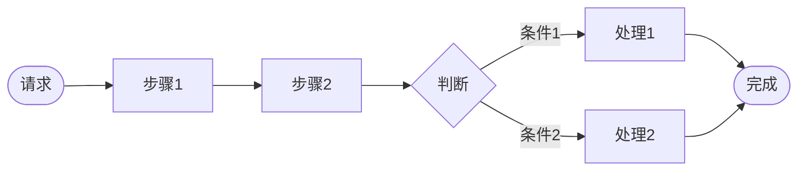
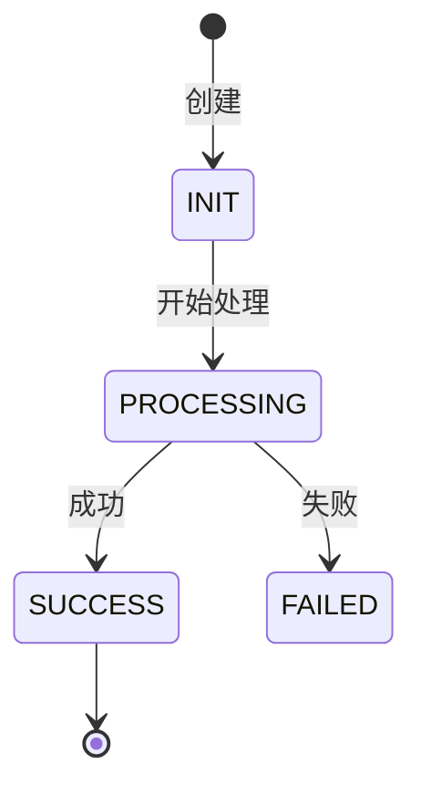
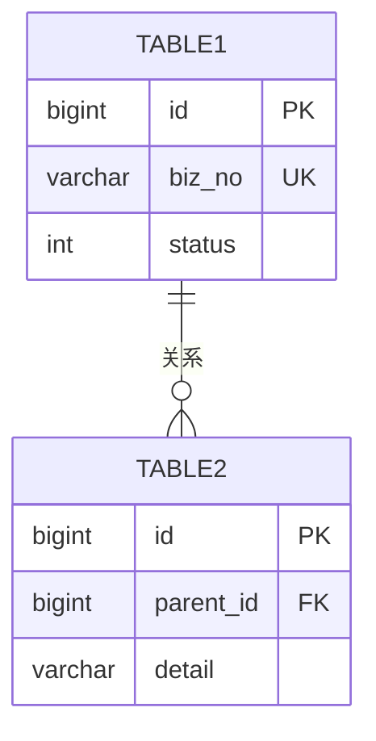

# 完整文档模板

> 直接复制使用，按需删减不适用章节。

```markdown
# [系统名称] 项目分析文档

> 本文档帮助你快速理解 [系统名称] 的业务定位、核心流程和技术架构。

---

## 文档信息

| 项目 | 内容 |
|------|------|
| 系统名称 | [填写] |
| 代码仓库 | [填写] |
| 分析日期 | [填写] |
| 分析深度 | quick / standard / deep |
| 文档版本 | v2.0 |

---

## L0. 服务全景

> 本章帮助你快速了解系统的入口、依赖和流量概况。

### 0.1 服务入口统计

| 类型 | 数量 | TOP3 接口 | 14天流量 |
|-----|------|----------|---------|
| RPC | [N] | [接口1, 接口2, 接口3] | [X亿/万] |
| MQ | [N] | [topic1, topic2] | [X万] |
| HTTP | [N] | [path1, path2] | - |
| JOB | [N] | [job1, job2] | - |

### 0.2 上游调用统计（谁调用本服务）

| 入口方法 | 调用方 | 调用方方法 | 14天流量 |
|---------|-------|-----------|---------|
| [method1] | [caller-app1] | [callerMethod] | [X亿/万] |
| [method2] | [caller-app2] | [callerMethod] | [X万] |

### 0.3 下游依赖统计（本服务调用谁）

| 类型 | 数量 | TOP3 依赖 |
|-----|------|----------|
| RPC Client | [N] | [服务1, 服务2, 服务3] |
| MQ Producer | [N] | [topic1] |
| DB | [N] | [表1, 表2, 表3] |

### 0.4 流量概览

(可选：流量趋势图或热点分布)

| 流量维度 | 数值 | 说明 |
|---------|------|------|
| 日均 RPC 调用 | [X万] | [描述] |
| 日均 MQ 消息 | [X万] | [描述] |
| 峰值 QPS | [X] | [时段] |

---

## L1. 项目概览

> 本章帮助你在5分钟内建立对系统的整体认知。

### 1.1 系统定位

**一句话描述**：[系统名称] 是 [所属业务域] 的 [核心定位]，负责 [主要职责]。

### 1.2 业务价值

| 价值维度 | 说明 |
|---------|------|
| 解决什么问题 | [填写] |
| 服务哪些业务 | [填写] |
| 核心业务指标 | [填写] |

### 1.3 核心能力

| 能力 | 说明 | 业务场景 |
|------|------|---------|
| 能力1 | [填写] | [填写] |
| 能力2 | [填写] | [填写] |

### 1.4 系统边界

(系统边界 Mermaid 图)

**上游系统**：
| 系统名称 | 交互方式 | 交互内容 |
|---------|---------|---------|
| [填写] | MQ/RPC | [填写] |

**下游系统**：
| 系统名称 | 交互方式 | 交互内容 |
|---------|---------|---------|
| [填写] | RPC | [填写] |

### 1.5 技术架构

(分层架构 Mermaid 图)

**技术栈**：
| 类别 | 技术 |
|------|------|
| 语言 | [如：Java 8] |
| 框架 | [如：Spring Boot] |
| 数据库 | [如：MySQL] |

### 1.6 业务术语表

| 术语 | 英文 | 说明 |
|------|------|------|
| [术语1] | [Term1] | [解释] |

---

## L2. 业务全景

> 本章帮助你了解系统支持的所有业务场景。以场景矩阵为核心，展示"什么事件 × 什么场景 → 什么行为"。

### 2.1 业务触发来源

| 触发类型 | 来源 | 说明 |
|---------|------|------|
| 消息队列 | Topic: [填写] | [描述] |
| RPC调用 | 服务: [填写] | [描述] |
| 定时任务 | Job: [填写] | [描述] |

### 2.2 业务身份体系

> 三级业务身份决定了系统的路由和配置选择。

| 层级 | 名称 | 说明 | 取值示例 |
|------|------|------|---------|
| 一级 | bizIdentity（业务身份） | [填写] | [如：SFDS] |
| 二级 | bizScene（业务场景） | [填写] | [如：BIZ_SCENE_DE, BIZ_SCENE_EE] |
| 三级 | bizEvent（业务事件） | [填写] | [如：ORDER_PAID, ORDER_FINISHED] |

### 2.3 事件×场景处理矩阵

> **核心产出**：展示每个事件在不同业务场景下的处理行为。

| 事件 | 场景A | 场景B | 场景C | 场景D |
|------|:-----:|:-----:|:-----:|:-----:|
| [EVENT_1] | [行为] | [行为] | -- | [行为] |
| [EVENT_2] | [行为] | [行为] | [行为] | -- |
| [EVENT_3] | [行为] | [行为] | -- | [行为] |

> 单元格填写：`--` = 不处理，`计费` = 仅触发计费，`计费+N指令` = 计费并生成 N 条结算指令

### 2.4 能力使用矩阵

> **条件产出**：仅在系统存在多场景差异时展示。

| 能力类型 | 场景A正向 | 场景A逆向 | 场景B正向 | 场景B逆向 |
|---------|:--------:|:--------:|:--------:|:--------:|
| [CAPABILITY_1] | [N] | -- | [N] | -- |
| [CAPABILITY_2] | -- | [N] | -- | [N] |

### 2.5 场景间核心差异

> **横切对比**：按维度/能力分章节对比各场景，而非纵切按场景各自描述。

| 结算项 | 场景A | 场景B | 差异说明 |
|--------|------|------|---------|
| [项目1] | [公式/规则] | [公式/规则] | [差异点] |
| [项目2] | [公式/规则] | [公式/规则] | [差异点] |

### 2.6 业务场景分类

(业务场景树 Mermaid 图)

### 2.7 典型场景实例

| 维度 | 内容 |
|------|------|
| 场景名称 | [如：B2C订单收货结算] |
| 业务身份 | [三级身份] |
| 触发来源 | [MQ Topic + Tag / RPC] |
| 生效配置 | [关键配置项及值] |
| 代码路径 | [核心处理类] |
| 处理行为 | [计费指令 + 能力组合] |
| 执行结果 | [生成的指令] |
| 下游调用 | [调用的服务] |

---

## L3. 核心链路

> 本章帮助你理解核心业务和关键链路的详细流程。

### 3.1 核心业务识别

基于流量和业务分析，识别到以下核心业务：

| # | 核心业务 | 包含链路数 | 14天总流量 | 评估 |
|---|---------|-----------|-----------|------|
| 1 | [业务名] | [N] | [X亿] | ★★★ |
| 2 | [业务名] | [N] | [X亿] | ★★☆ |

### 3.2 核心业务: [业务名称1]

#### 链路概览

| # | 链路名称 | 入口 | 14天流量 | 操作类型 |
|---|---------|-----|---------|---------|
| 1.1 | [链路名] | RPC: method | [X亿] | 写 |
| 1.2 | [链路名] | RPC: method | [X万] | 写 |

#### 1.1 链路: [链路名称]

##### 业务流程



##### 数据流转

| 表 | 操作 | 说明 |
|---|------|-----|
| [表名1] | INSERT | [说明] |
| [表名2] | UPDATE | [说明] |

##### 状态流转

(仅当有明确状态变化时)



##### 核心代码

| 阶段 | 类 | 方法 | 行号 |
|------|---|------|-----|
| 入口 | [类名] | [方法名] | [N] |
| 核心 | [类名] | [方法名] | [N] |

#### 1.2 链路: [链路名称]

(同上格式)

### 3.3 核心业务: [业务名称2]

(同上格式)

---

## L4. 技术流程

> 本章从**技术视角**帮助你理解系统如何实现。

### 4.1 正向流程时序图

(时序图 Mermaid)

**关键节点说明**：
| 阶段 | 关键操作 | 技术要点 | 代码位置 |
|------|---------|---------|---------|
| 阶段一 | [操作] | [要点] | [类名:行号] |

### 4.2 状态流转

(状态机 Mermaid 图)

**状态说明**：
| 状态 | 业务含义 | 流转条件 | 技术触发点 |
|------|---------|---------|-----------|
| [状态] | [含义] | [条件] | [类:方法] |

### 4.3 异常与补偿

**异常处理策略**：
| 异常类型 | 处理策略 | 重试机制 | 代码位置 |
|---------|---------|---------|---------|
| [异常] | [策略] | [次数] | [类:行号] |

**补偿机制**：
| 补偿任务 | 触发条件 | 执行周期 | 处理逻辑 |
|---------|---------|---------|---------|
| [任务] | [条件] | [周期] | [逻辑] |

### 4.4 错误码速查

> 仅在检测到自定义错误码定义 >= 3 个时生成。帮助快速定位异常原因和排查路径。

| 错误码 | 错误信息 | 触发场景 | 排查路径 | 代码位置 |
|--------|---------|---------|---------|---------|
| [CODE] | [描述] | [链路+条件] | [XRay关键词 → DMS查询 → 配置检查] | [类:行号] |

**高频错误 TOP N**：
| 排名 | 错误码 | 近期出现频率 | 影响链路 | 紧急程度 |
|------|--------|------------|---------|---------|
| 1 | [CODE] | [频率] | [链路] | 高/中/低 |

---

## L5. 数据模型

> 本章帮助你理解数据如何存储和关联。

### 5.1 全量实体关系图



### 5.2 核心表清单

| 表名 | 业务含义 | 记录数量级 | 核心索引 |
|------|---------|-----------|---------|
| [表名1] | [含义] | [X万/亿] | [索引] |
| [表名2] | [含义] | [X万/亿] | [索引] |

### 5.3 表结构详情

#### 表: [table_name_1]

**业务含义**：[描述]

| 字段名 | 类型 | 约束 | 业务含义 |
|-------|------|------|---------|
| id | bigint | PK | 主键 |
| biz_no | varchar(64) | UK | 业务单号 |
| status | int | - | 状态 |
| created_at | datetime | - | 创建时间 |

**索引说明**：
| 索引名 | 字段 | 用途 |
|--------|------|------|
| uk_biz_no | biz_no | 业务单号唯一约束 |
| idx_status_time | status, created_at | 状态+时间范围查询 |

#### 表: [table_name_2]

(同上格式)

### 5.4 关键字段语义

| 字段 | 业务语义 | 取值说明 | 示例 |
|------|---------|---------|------|
| [字段] | [含义] | [枚举值] | [示例] |

### 5.5 数据生命周期

| 阶段 | 触发条件 | 数据变化 | 保留时间 |
|------|---------|---------|---------|
| 创建 | [条件] | [变化] | - |
| 归档 | [条件] | [变化] | [时间] |

### 5.6 常用查询模板

> 仅在检测到 @TableName/@Table 注解时生成。提供可直接在 DMS 中使用的 SQL 模板。

**分片信息**：
| 分片策略 | 分片键 | 分片数 | 说明 |
|---------|--------|-------|------|
| [策略] | [字段名] | [N] | [如：按 seller_id 256 分片] |

#### [核心表1] 查询模板

**核心字段速查**：
| 字段 | 业务含义 | 常见值 |
|------|---------|-------|
| [field] | [含义] | [枚举/格式] |

**按业务单号查**：
```sql
SELECT * FROM [table_name]
WHERE [sharding_key] = '[value]'
  AND [biz_no_field] = '[value]'
LIMIT 10;
```

**按状态查**：
```sql
SELECT * FROM [table_name]
WHERE [sharding_key] = '[value]'
  AND status = [status_value]
ORDER BY created_at DESC
LIMIT 10;
```

**卡住状态排查**：
```sql
SELECT * FROM [table_name]
WHERE [sharding_key] = '[value]'
  AND status IN ([中间态列表])
  AND updated_at < DATE_SUB(NOW(), INTERVAL 1 HOUR)
LIMIT 20;
```

#### [核心表2] 查询模板

(同上格式)

### 5.7 数据库抽样验证

> 仅在 deep 模式 + xhs-tools DMS 可用时生成完整抽样。standard 模式仅生成空表检测。
> 通过实际数据库查询验证代码识别的表是否存在、是否有数据、枚举值是否一致。

**表级抽样结果**：

| 表名 | 代码识别 | DMS 可查 | 单分片估算 | 状态 | 说明 |
|------|:-------:|:-------:|-----------|:----:|------|
| [table_name] | Y | Y | ~X万/分片 | 正常 | 核心表 |
| [table_name] | Y | **空表** | 0 | 警告 | 历史遗留 |

**枚举覆盖验证**：

| 表.字段 | 代码定义枚举值 | DB 实际值 | 覆盖率 | 未知值 |
|---------|-------------|----------|:------:|-------|
| [table.status] | [枚举列表] | [实际值列表] | [%] | [未知值] |

**状态分布**（仅对核心表的状态字段）：

| 表.字段 | 状态值 | 数量 | 占比 | 业务含义 | 异常标记 |
|---------|-------|------|:----:|---------|:-------:|
| [table.status] | [value] | [N] | [%] | [含义] | [标记] |

> 异常标记规则：中间态占比 > 5% → ⚠️ 可能卡住；出现代码未定义值 → 未知值

### 5.8 字段类型检查

> 仅在 deep 模式 + xhs-tools get_cached_table_schema 可用时生成。
> 对比 Java Entity 字段类型与 MySQL 实际列类型，识别潜在风险。

**类型匹配结果**（仅列出有风险项，匹配正常的省略）：

| 表 | 字段 | Java 类型 | MySQL 类型 | 风险 | 说明 |
|----|------|----------|-----------|:----:|------|
| [table] | [field] | [java_type] | [mysql_type] | [HIGH/MEDIUM/LOW] | [说明] |

**汇总**：

| 风险级别 | 数量 | 影响表 | 建议 |
|---------|:----:|-------|------|
| **HIGH** | [N] | [表列表] | 需立即评估修复 |
| **MEDIUM** | [N] | [表列表] | 建议排期优化 |
| **LOW** | [N] | [表列表] | 知晓即可 |
| 匹配 | [N] | -- | 正常 |

**业务规则检查**：

| 检查项 | 规则 | 通过 | 违规字段 |
|--------|------|:----:|---------|
| 金额字段类型 | 含 amount/fee/income → Long/BigDecimal ↔ bigint/decimal | [Y/N] | [列表] |
| 分片键类型 | sharding_key → String ↔ varchar | [Y/N] | [列表] |
| ID 字段类型 | 含 _id → Long ↔ bigint | [Y/N] | [列表] |

---

## L6. 配置与扩展

> 本章帮助你理解系统行为如何通过配置控制。

### 6.1 核心配置项

**开关类配置**：
| 配置键 | 默认值 | 业务含义 | 变更影响 |
|--------|--------|---------|---------|
| [配置] | [值] | [含义] | [影响] |

### 6.2 策略规则

| 策略类型 | 枚举值 | 业务含义 | 匹配条件 |
|---------|--------|---------|---------|
| [类型] | [值] | [含义] | [条件] |

### 6.3 扩展机制

| 扩展点 | 扩展方式 | 示例 |
|--------|---------|------|
| [扩展点] | [方式] | [示例] |

### 6.4 配置影响范围

| 配置项 | 影响的业务场景 | 影响说明 | 变更风险 |
|--------|---------------|---------|---------|
| [配置] | [场景列表] | [描述] | 高/中/低 |

### 6.5 配置详情（三段式）

> 仅在多场景系统的 deep 模式下展开。对应 L2 核心公式差异的全量版本。

**1. 业务身份匹配配置**：

| 配置项 | 值 | 说明 |
|--------|-----|------|
| bizIdentity | [值] | [一级身份] |
| bizScene | [值] | [二级场景] |
| bizEvent | [值] | [三级事件] |
| effectiveConditions | [MVEL表达式] | [生效条件] |

**2. 结算能力配置**：

| 结算能力 | 金额计算公式 | 说明 |
|---------|-------------|------|
| [能力] | [公式] | [说明] |

**3. 计费策略点配置**：

| 策略点 | 取值方式 | 取值表达式/值 | 说明 |
|--------|---------|--------------|------|
| [策略点] | FIXED/MVEL/FEE_ITEM | [值] | [说明] |

---

## 附录

### A. 快速问答 (FAQ)

**Q1: [常见问题1]？**
A: [回答]

### B. 核心文件索引

| 层级 | 模块 | 关键文件 | 职责 |
|------|------|---------|------|
| 入口层 | [模块] | [文件路径] | [职责] |

### C. 相关文档链接

- [相关文档1](链接)

### D. XRay 日志查询模板

> 基于 L0 服务名和 L3 链路入口自动生成。帮助快速定位线上问题。

**服务信息**：
- 服务名（subApplication）：`[service-name]`
- 环境：sit / beta / prod

**基础查询模板**：

| 查询场景 | XRay 查询语法 | 使用场景 |
|---------|-------------|---------|
| 全链路追踪 | `xrayTraceId: {traceId}` | 已知 traceId，追踪完整调用链 |
| 按业务单号 | `{bizNoField}: {value} AND subApplication: [service-name]` | 查特定订单/单据的处理日志 |
| 按错误级别 | `level: ERROR AND subApplication: [service-name]` | 排查服务错误 |

**链路定制查询**（基于 L3 核心链路）：

| 链路 | 查询语法 | 说明 |
|------|---------|------|
| [链路1名称] | `[入口方法关键词] AND subApplication: [service-name]` | [链路说明] |
| [链路2名称] | `[入口方法关键词] AND subApplication: [service-name]` | [链路说明] |

**常见错误日志关键词**：

| 关键词 | 含义 | 后续排查动作 |
|--------|------|------------|
| `Exception` | 异常堆栈 | 查看错误码 → 对照 L4.4 错误码速查 |
| `timeout` | 超时 | 检查下游服务 → 确认超时配置 |
| `retry` | 重试 | 确认幂等性 → 检查重试次数 |
| `FAILED` | 处理失败 | DMS 查状态 → 确认是否需要补偿 |
| `duplicate` | 重复 | 检查幂等键 → 确认去重逻辑 |

### E. 故障诊断决策树

> 基于 L4 异常处理和 L5 数据模型构建。仅在 deep 模式 + L4 异常策略 >= 3 种时生成。
> 使用文本格式（非 Mermaid），更利于 LLM 解析和引用。

**故障诊断入口**：

```
[故障现象1]: [如：RPC 调用超时]
├── 检查1: 查 XRay 日志确认超时位置
│   → 查询: level: ERROR AND timeout AND subApplication: [service-name]
│   ├── 超时在本服务 → 检查本地处理耗时（DB 慢查询？锁等待？）
│   │   → DMS: SELECT * FROM [table] WHERE ... AND updated_at > ? LIMIT 10
│   └── 超时在下游 → 检查下游服务状态
│       → XRay: subApplication: [downstream-service] AND level: ERROR
├── 检查2: 确认是否批量超时（单笔 vs 批量）
│   ├── 单笔 → 大概率是数据问题，查具体单据
│   └── 批量 → 大概率是系统问题，查资源和配置
└── 修复: [修复方式]

[故障现象2]: [如：状态卡住未流转]
├── 检查1: DMS 查询卡住记录
│   → DMS: SELECT * FROM [table] WHERE status IN ([中间态]) AND updated_at < DATE_SUB(NOW(), INTERVAL 1 HOUR) LIMIT 20
├── 检查2: 查 MQ 消息是否已投递
│   → 查询对应 Topic 的消息投递记录
├── 检查3: 查补偿任务是否执行
│   → XRay: [补偿Job名称] AND subApplication: [service-name]
└── 修复: 手动触发补偿 / 修复数据状态

[故障现象3]: [如：金额计算错误]
├── 检查1: 查结算/计费记录
│   → DMS: SELECT * FROM [fee_table] WHERE biz_no = ? AND sharding_key = ?
├── 检查2: 核对 Apollo 配置
│   → 确认对应场景的费率/公式配置是否正确
├── 检查3: 核对入参数据
│   → XRay 查看 RPC 请求入参
└── 修复: 修正配置 / 补偿差额
```

**常见故障排查手册**：

| 故障类型 | 首查位置 | 常用 DMS 查询 | 常用 XRay 查询 | 修复方式 |
|---------|---------|-------------|--------------|---------|
| RPC 超时 | XRay 错误日志 | -- | `timeout AND subApplication: [svc]` | 调整超时/优化慢查询 |
| 状态卡住 | DMS 中间态记录 | `status IN (?) AND updated_at < ?` | `[补偿Job] AND [svc]` | 触发补偿任务 |
| 金额异常 | DMS 计费记录 | `biz_no = ? AND sharding_key = ?` | RPC 入参日志 | 修正配置/补偿 |
| 重复处理 | DMS 重复记录 | `biz_no = ? GROUP BY ... HAVING COUNT > 1` | `duplicate AND [svc]` | 确认幂等/去重 |
| 消息丢失 | MQ 投递记录 | -- | `topic: [topic] AND [bizNo]` | 重发消息/手动补偿 |

### F. 准出报告

> 3 轮双文档验证完成后的准出门禁检查报告。

#### F.1 准出门禁

| 条件 | 状态 |
|------|------|
| 3 轮完成 | [✅/❌] |
| P0 全 PASS | [✅/❌] |
| hop_rate >= 90% | [✅/❌ 当前 X%] |
| FK 合规 | [✅/❌ N 处违规] |
| **准出结论** | **[PASS/FAIL]** |

#### F.2 轮次对比

| 指标 | Round 1 | Round 2 | Round 3 |
|------|---------|---------|---------|
| 总跳数 | [N] | [N] | [N] |
| PASS | [N] | [N] | [N] |
| FAIL | [N] | [N] | [N] |
| 跳通过率 | [%] | [%] | [%] |
| FK 违规 | [N] | [N] | [N] |

#### F.3 最终 FK 关系矩阵

| Step | 上游表 | FK 字段 | 关系 | 下游表 | FK 字段 | FK 类型 |
|------|--------|---------|------|--------|---------|---------|
| | | | | | | |

#### F.4 验证文档索引

| 轮次 | 文件 | 验证日期 |
|------|------|---------|
| Round 1 | arch-analysis/verification/round-1-verification.md | [日期] |
| Round 2 | arch-analysis/verification/round-2-verification.md | [日期] |
| Round 3 | arch-analysis/verification/round-3-verification.md | [日期] |

### G. 验证轮次索引

> 指向各轮验证文档和分析文档的版本历史。

| 轮次 | 验证文档 | 分析文档版本 | 跳通过率 | FK 违规 | 修正内容 |
|------|---------|------------|---------|---------|---------|
| Round 1 | [round-1-verification.md](链接) | v1 | [%] | [N] | (初始版本) |
| Round 2 | [round-2-verification.md](链接) | v2 | [%] | [N] | [修正说明] |
| Round 3 | [round-3-verification.md](链接) | v3 | [%] | [N] | [修正说明] |

---

**文档版本**: v4.0
**更新时间**: [日期]
**维护人员**: [姓名]
```
