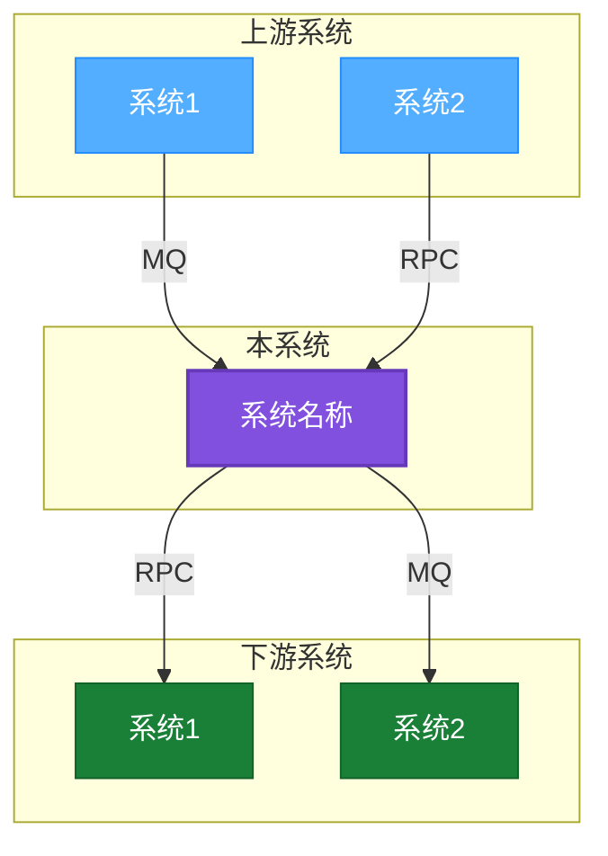
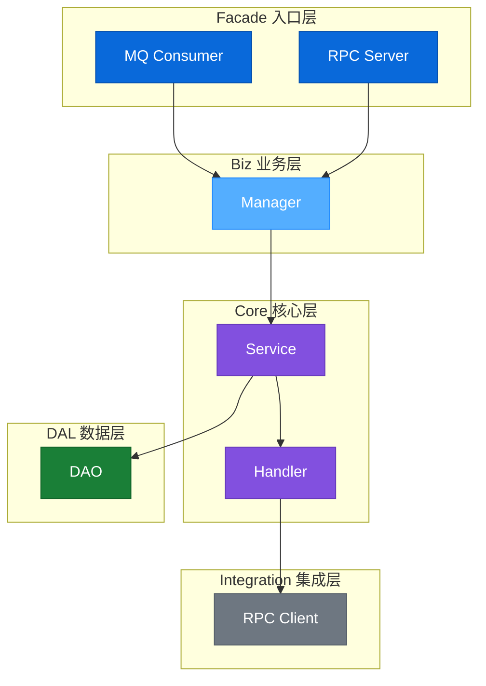
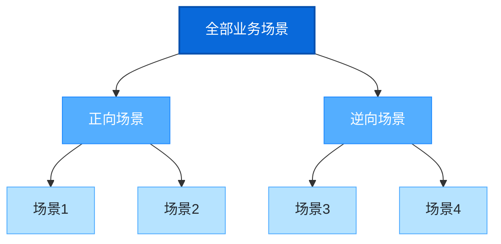
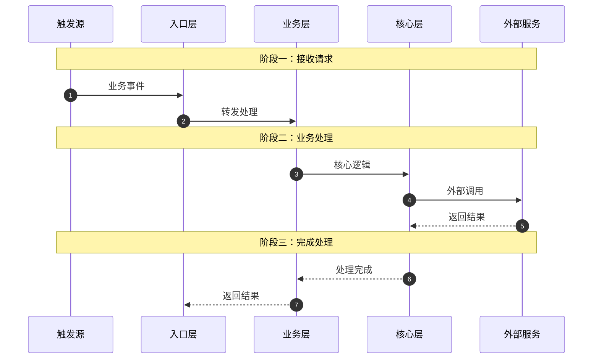
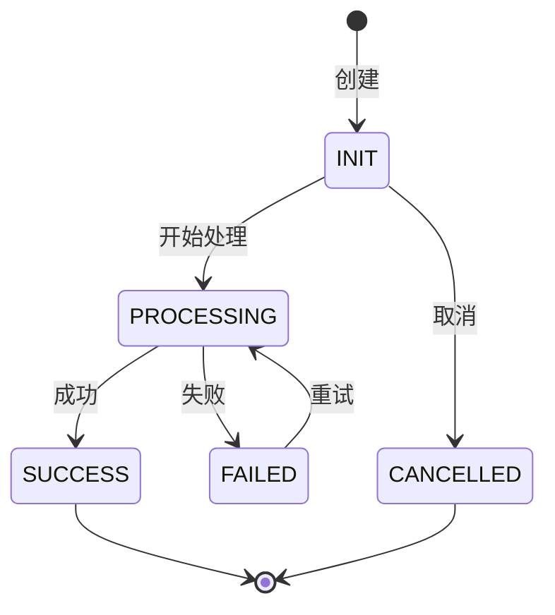
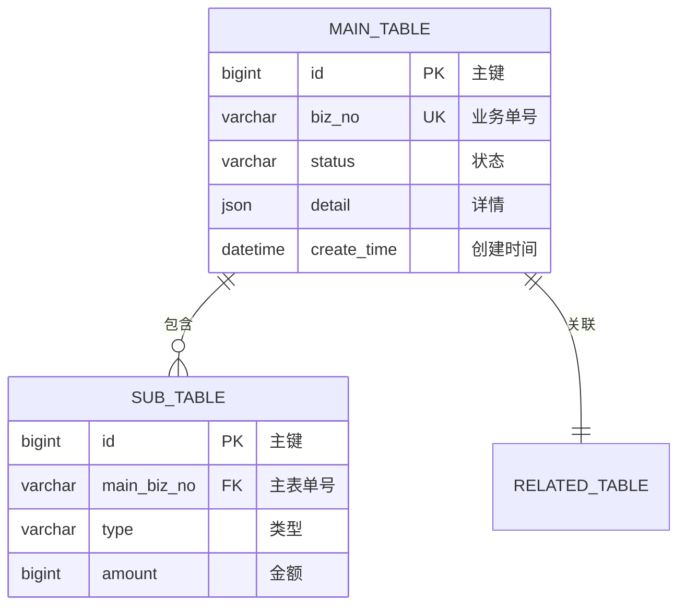
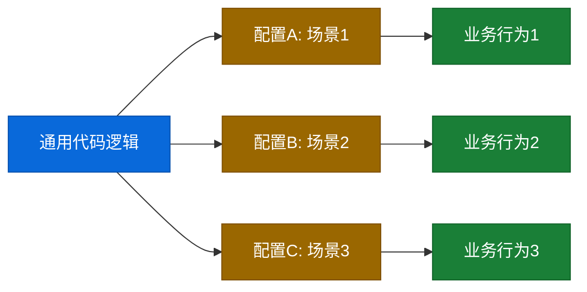
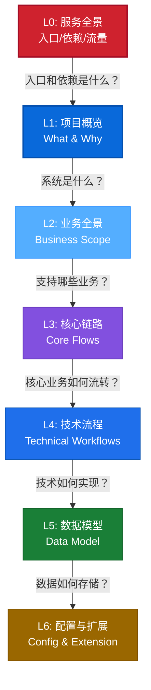

# Mermaid 图表模板库

## 配色主题

```
classDef primary fill:#0969DA,stroke:#0550AE,stroke-width:1px,color:#FFFFFF
classDef secondary fill:#54AEFF,stroke:#218BFF,stroke-width:1px,color:#FFFFFF
classDef tertiary fill:#B6E3FF,stroke:#54AEFF,stroke-width:1px,color:#24292F
classDef light fill:#DDF4FF,stroke:#B6E3FF,stroke-width:1px,color:#24292F
classDef success fill:#1A7F37,stroke:#116329,stroke-width:1px,color:#FFFFFF
classDef warning fill:#9A6700,stroke:#7D4E00,stroke-width:1px,color:#FFFFFF
classDef error fill:#CF222E,stroke:#A40E26,stroke-width:1px,color:#FFFFFF
classDef neutral fill:#6E7781,stroke:#57606A,stroke-width:1px,color:#FFFFFF
classDef highlight fill:#8250DF,stroke:#6639BA,stroke-width:1px,color:#FFFFFF
```

## 颜色语义规范

| 样式类 | 语义 | 使用场景 |
|--------|------|---------|
| `primary` | 入口/触发点 | MQ消息、RPC入口、起始节点 |
| `secondary` | 主要处理 | 核心服务、业务逻辑 |
| `tertiary` | 次要处理 | 辅助服务、工具类 |
| `success` | 正向/成功 | 正向流程、成功状态 |
| `warning` | 警告/判断 | 条件分支、待处理 |
| `error` | 错误/逆向 | 逆向流程、失败状态 |
| `highlight` | 核心节点 | 关键组件、重点标注 |

---

## 系统边界图



---

## 分层架构图



---

## 业务场景树



---

## 业务流程图（左右流向）


---

## 时序图



---

## 状态机



---

## ER 图



---

## 配置与行为映射图



---

## 七层递进框架图


